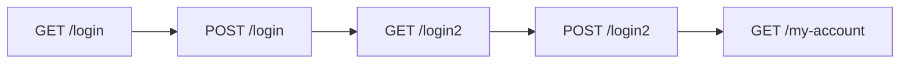

# Authentication
## Username enumeration via different responses
- This lab is vulnerable to username enumeration and password brute-force attacks. It has an account with a predictable username and password, which can be found in the given wordlists.
- To solve the lab, enumerate a valid username, brute-force this user's password, then access their account page. 
### Enumeration
![[Pasted image 20220805111139.png]]
- We tried to login with random credentials and realised that there is a "Invalid username".
![[Pasted image 20220805113248.png]]
- We realised that logging in is through POST request.
![[Pasted image 20220805113428.png]]

### Vulnerability Assessmemnt / Exploitation
- We will try to test with the given username list with Burp Intruder using Sniper attack type.
![[Pasted image 20220805113636.png]]
![[Pasted image 20220805113837.png]]
![[Pasted image 20220805113909.png]]
![[Pasted image 20220805114332.png]]
- From the above, we can see that atlanta is the one with a different response length compared to other responses. 
![[Pasted image 20220805114402.png]]
- We realised that our hypothesis above is right that a correct username can be enumerated.
![[Pasted image 20220805114727.png]]
- Next we set the password field as the field to attack.
![[Pasted image 20220805114820.png]]
- From the above, we see that with the password `computer`, there is a `HTTP 302` (redirect). This is likely the correct credentials.
![[Pasted image 20220805114905.png]]
- We login with the credentials `atlanta:computer` and we managed to login.

## 2FA simple bypass
- This lab's two-factor authentication can be bypassed. 
- You have already obtained a valid username and password, but do not have access to the user's 2FA verification code. 
- To solve the lab, access Carlos's account page. Your credentials: `wiener:peter` and Victim's credentials `carlos:montoya`

### Enumeration
- As this is a 2FA bypass challenge, we will skip the thorough mapping of the website. Below is the "Home" page.
![[Pasted image 20220805211943.png]]
- We simply, go directly to the login page and is faced with the page below.
![[Pasted image 20220805211923.png]]
- We then attempt login with `wiener:peter` credentials and got to the 2FA page below.
![[Pasted image 20220805211830.png]]
- We go to the email client and retrieved the 2FA code to login to the account.
![[Pasted image 20220805212709.png]]
- Then we get to the page below.
![[Pasted image 20220805211848.png]]
- The transactions above are logged in burp proxy and can be seen below. We repeated the steps above, but did not key in the correct 2FA the next time.
![[Pasted image 20220805213651.png]]
- As can be seen above, a successful login procedures are as follows 

- We then examine the Request/Response in the sequence above to see if there might be any clue.
![[Pasted image 20220805214102.png]]
![[Pasted image 20220805214133.png]]
![[Pasted image 20220805214150.png]]
![[Pasted image 20220805214205.png]]
- Looking closely at the logic above, we see that the session cookie produced by `/login` and `/login2` are different. 
- However, we do notice that `/login` and `/login2` are 2 different resources and that the session cookie generated by `/login` will allow access to `/login2`  
### Vulnerability Assessment / Exploitation
- Going by the logic above, there might be a possibility that `/my-account` can also be accessed by the session cookie generated by `/login2`. 
![[Pasted image 20220805214520.png]]
![[Pasted image 20220805214633.png]]
![[Pasted image 20220805214703.png]]

## Password reset broken logic
 - This lab's password reset functionality is vulnerable. 
 - To solve the lab, reset Carlos's password then log in and access his "My account" page. 
 - Your credentials: `wiener:peter` and Victim's username: `carlos`.
### Enumeration
- As this is a password reset challenge, we will skip the thorough mapping of the website. Below is the "Home" page.
![[Pasted image 20220805215526.png]]
- We simply, go directly to the login page and is faced with the page below.
- There is a "Forgot password" button.
![[Pasted image 20220805215611.png]]
- We map the login process by logging in with `wiener:peter` and the result is as follows.
![[Pasted image 20220805215549.png]]
- We then go on to map the forget password process by accessing the "Forgot password" button. We get the page below.
![[Pasted image 20220805215629.png]]
- Then we subsequently submitted a password reset request using wiener's username.
![[Pasted image 20220805215720.png]]
- Below is the link received by wiener's email.
![[Pasted image 20220805215822.png]]
- The webpage below is the reset password page.
![[Pasted image 20220805215836.png]]
- An interesting observation is the password reset request as seen below.
![[Pasted image 20220805221516.png]]
- The temporary token, username to reset and new password are passed as a parameters for password reset. 

### Vulnerability Assessment / Exploitation
- Continuing from the thought process above, we can test if the token is universal or that we can reuse the same token but change the username.
- We used burp repeater to send the request and changed username from `wiener` to `carlos`.
![[Pasted image 20220805221021.png]]
- We attempt to login to carlos with the password we set and we were successful.
![[Pasted image 20220805221107.png]]