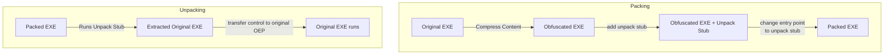
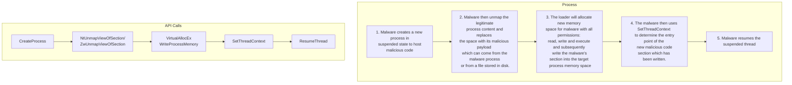

# Windows Obfuscation Techniques
[[#Introduction]]
[[#Encoding Encryption Techniques]]
[[#Packer and Cryptors]]
- [[#Signs of Packing]]
- [[#Packing Unpacking Process]]
- [[#Unpacking]]
   -  [[#Approaches in Unpacking]]
	- [[#Methods in Unpacking]]
	- [[#Common Packers]]

[[#Anti-Analysis Techniques]]
- [[#Anti-Debug Techniques]]
- [[#Anti-Disassembly Techniques]]
- [[#Anti-VM Techniques]]

[[#Process Hollowing]]
- [[#Illustration of Proccess Hollowing]]
- [[#Using API Monitor to Observe Process Hollowing]]

---

## Introduction
- obfuscation is a method used to transform binary and textual and textual data into unreadable form and/or hard to understand.
- There are three broad categories of obfuscation : encoding, encryption and packing.
- Generally, obfuscation are used to : 
	1. hide C2 communication
	2. avoid detection by signature-based tools (AV, IDS, IPS,  yara etc.)
	3. obscure strings used in malicious binary to protect against static analysis
## Encoding/Encryption Techniques
- malware authors can add garbage lines of code or change the the execution order of the actual code without altering the inner instructions in the program to evade signature based malware detection.
- They can also use a combination of encryption/encoding techniques to make the identification of the crypto scheme difficult.
1. Simple Arithmetic
   - where basic mathematical operation (addition,subtraction,multiplication,division) is done at byte level to encrypt / decrypt the file.
2. Caesar Cipher
   - substitution of letters in the plaintext with another letter in the alphabet by shifting the letters by a fixed number of positions.
3. XOR Cipher
	- Interesting feature of `XOR` is that you can retrieve the plaintext from ciphertext by simply XORing with the encryption key, which means that the encryption and decryption function is the **same**.
	- Another interesting feature of `XOR` is that XORing a null byte (`0x00`) with the a value will yield they value.
		- Example `0x05 XOR 0x00 = 0x05`
		- therefore encoding with XOR can leak to single byte `XOR` key leak if null byte exists and partial key leaks for multi-byte `XOR`.
		- Thus malware author will ignore null bytes during encoding process so that key is not leaked. 
	- There are also 2 other mechanisms used by malware author to prevent XOR deobfuscation : 
		1. Use a 2 cycle approach, where the executable is xor-ed once with one key value at first and then xor-ed again with another key value.
		2. use a loop to increase XOR value. 
	- There are two types of XOR cipher Single-Byte and Multi-Byte.

|                    | Single Byte XOR                                                                                                  | Multi Byte XOR                                                                                                                             |
|--------------------|------------------------------------------------------------------------------------------------------------------|--------------------------------------------------------------------------------------------------------------------------------------------|
| What is it?        | application of a  function on each byte  of the plaintext  with the encryption key  not more than 1 byte `0xFF`  | application of XOR function with a key of more than 1 byte, thus XORing a number of bytes  at a time based on the length of  the key used. |
| Tools              | - XORSearch - ConverterNET <br> - Balbuzard - unXOR<br> - Cyberchef - brxor.py<br> - NoMoreXOR.py                | - xortool                                                                                                                                  |
| Bruteforce         | - Easy as there is only 0xFF  number of keys                                                                     | - Difficult as the permutations on  the number of key is way more                                                                          |
| Null byte Key Leak | Full disclosure of key  if null byte is not ignored                                                              | Partial Disclosure of key if null byte  is not ignored                                                                                     |

4. Base64 Encoding
   - [Base64 Encoding Details](https://en.wikipedia.org/wiki/Base64)

## Packer and Cryptors
- a packer is a software that obfuscate an executable by compressing its content and generating a new executable.
- A cryptor functions simlar to a packer but encrypts the executable instead.
- Malware authors use packers and/or cryptors to obfuscate their binaries and make it less detectable by AV and harder to do static analysis/reverse engineer.
### Signs of Packing

|                                 |                                                                |                                                                                                               |
|---------------------------------|----------------------------------------------------------------|---------------------------------------------------------------------------------------------------------------|
| Unusually Low number of Imports | Imports where there is only `LoadLibrary` or `GetProcAddress`. | amount of code is smaller than usual (can be viewed with IDA pro)                                             |
| Unusually low number of strings | High Entropy                                                   | Unusual section which may indicate the specific packer used.<br>   - e.g UPX0, UPX1 suggesting the use of UPX |
| abnormal size of sections       | analysis program (DiE/OllyDbg) indicating signs of packing.    |                                                                                                               |

### Packing & Unpacking Process



![[Pasted image 20220601163957.png|650]]
 
### Unpacking
  - The unpacking stub will do 3 actions :
	   1. Unpack packed executable and load it into memory
	   2. Fix the import table of the executable so that import can be resolved.
	   3. Point to the original executable's OEP(Original Entry Point).
- Finding the **Tail Jump** is the main goal of unpacking. It can be thought of as the last step of the unpacker where the next step through will lead you to the original OEP of the executable. 
- Tail Jump can come in the form of a `jmp` instruction and in more sophisticated cases a `ret` or `call` instruction. OS functions like `NtContinue` or `ZwContinue`   
#### Approaches in Unpacking 

| Approach | Explanation                                                                                                                                                                                                                                                                                                                      |
|----------|----------------------------------------------------------------------------------------------------------------------------------------------------------------------------------------------------------------------------------------------------------------------------------------------------------------------------------|
| 1        | - Unpacking Stub uses `LoadLibrary` & `GetProcAddress` functions <br>  - The stub reads the import information of the original file and uses  `LoadLibrary` to load the DLL in memory and then `GetProcAddress` to get  the addresses of the functions that the executable imports                                               |
| 2        | - Packer does not tamper with the original import table<br> - The unpacking stub will have a loader to load the DLL and imported functions  an their addresses in memory<br> - This method lacks stealth and is usually used in packers that focuses on  compression and performance rather than security.                       |
| 3        | - Packer will keep one import function from the original import table from each DLL imported  so that only one function is revealed.<br> - stealthier than Approach 2 and much simpler to implement than Approach 1 as there is no need to  load libraries but it still is required to resolve the functions that it requires.   |
| 4        | - Unpacker stub will have no libraries and need to search for functions needed and  rebuild the import table in runtime  <br> - An alternative will be that the unpacking stub searches for `LoadLibrary` and `GetProcAddress` functions and use them to find other libraries <br> - This is the stealthiest approach in packing |

#### Methods in Unpacking
- Unpacking cannot recreate the original executable. 
- The goal of unpacking is to define the behaviour of the executable - to get the binary that exhibits the same behaviour as the original. 

##### Automated Static Unpacking
- Using a software that acts like the unpacking stub to decompress and/or decrypt the packed file.
- It is the fastest method and also the "safest" method as it can restore the executable without running it.
- However, these type of unpackers are usually built for specific version of packer and are rare.

##### Automated Dynamic Unpacking
- A software that is able to 
	1. identify the end of the execution of the unpacking stub the executable 
	2. run the unpacking stub that is embedded on the packed file 
	3. automatically rebuilds the import table and dumps out the unpacked executable.
- Tools : PE Explorer Plugins, CFF Explorer(UPX only)
##### Manual Unpacking 
###### Method 1 - Reverser Program
- Writing a Reverser Program based on the packing algorithm.

###### Method 2 - Dynamic Unpacking
- The idea is to run the packed library and set a breakpoint at the instruction right before `jmp` OEP. Then we step over to the next instruction where it will `jmp` to the OEP and dump the unpacked process in the memory to disk. We then proceed to fix the Import Address Table (IAT) of the dumped file. 
	- This is a good [illustration](https://www.goggleheadedhacker.com/blog/post/6) of the above Dynamic Unpacking method.
#### Common Packers

| S/N | Packer                      | Description                                                                                                                                                                                                                                                                                                                                                                                                         |
|-----|-----------------------------|---------------------------------------------------------------------------------------------------------------------------------------------------------------------------------------------------------------------------------------------------------------------------------------------------------------------------------------------------------------------------------------------------------------------|
| 1   | UPX                         | - free, open source and multi-platform. <br> - focuses more on performance than security <br> - UPX application has both pack and unpack functionality <br> - Pack  ```  upx -o <packed_name> <unpacked>  ```<br> - Unpack  ``` upx -d -o <unpacked_name> <packed>  ``` <br> - Many malware will appear to be packed with UPX but more often than not it is a modified UPX where the commands above will not be useful <br>  |
| 2   | PE Compact                  | - Commercial packer that focuses on performance <br> - obfuscates code and has anti-debug features <br> - is extensible by third party plugins making unpacking even more difficult <br> - OllyDbg needs to be configured to pass exceptions <br> - Tail Jump method can be done, requires to look for a `jmp eax` that precedes many `0x00` bytes                                                                  |
| 3   | ASPack                      | - Commercial packer focused on security <br> - uses different anti-debugging techniques like self-modifying code to complicate setting of breakpoints and software breakpoints may crash the program <br> - There are automated unpackers but the effectiveness varies                                                                                                                                              |
| 4   | Petite                      | - Free packer that is focused on performance<br> - employs various anti-debug techniques like single-step exceptions <br> - the import table is untouched, thus Static Analysis can still be done                                                                                                                                                                                                                   |
| 5   | WinUpack(GUI) / Upack (CLI) | - Focus is on compression not security<br> - Some anti-debugging techniques employed to counter OllyDump or searching for tail jump                                                                                                                                                                                                                                                                                 |

## Anti-Analysis Techniques
- Malware authors use a series of mechanisms within their code to make analysis difficult. They do so by preventing the analyst from having the environment to run, debug or disassemble the malware.
- These series of mechanisms could be the use Win32 APIs, Registry Key Value, code-level code and logic obfuscation.
### Anti-Debug Techniques 
- techniques used by malware authors to ensure that a program is not running under a debugger.
- The Windows API is a widely used tool to detect the presence of debuggers.
#### `IsDebuggerPresent`
##### Description[^1]
- Determines whether the calling process is being debugged by a user-mode debugger.
- This function checks for `BeginDebugged` field in the Process Environment Block (PEB)[^2]
- the return value is nonzero if the current process is running in the context of a debugger.
##### Bypass
- Refer to this guide IsDebuggerPresent Patching[^3]. There are two methods described to bypass, one is to set `BeginDebugged` to `0` on runtime and the other is to fill the code with enough`NOP` operations. 
- 
#### `IsDebugged` Field
##### Description [^14][^15]
- This is part of the PEB and can be found at location `fs:[30h]`. It is set by the system to `1` when a debugger is present.
##### Bypass
SImilar to IsDebuggerPresent bypass, we need to change the value of the flag to zero on runtime.

#### `NtGlobalFlag`
##### Description
- `NtGlobalFlag` is part of the PEB with default value of `0`
- It is found at offset 0x068 (x86) or 0x0bc (x64)
- It is made up of a set of flags and if a process is opened by a debugger, the following flags `FLG_HEAP_ENABLE_TAIL_CHECK (0X10)`, `FLG_HEAP_ENABLE_FREE_CHECK (0X20)` and `FLG_HEAP_VALIDATE_PARAMTERS (0X40)` will be set. 
- The flag value will add up to `0x70` hence a `NtGlobalFlag` with value `0x70` would signify that a debugger is used to create the process.
##### Bypass
- Similar to IsDebuggerPresent bypass, we need to change the value of the flag to zero on runtime.

#### `CheckRemoteDebuggerPresent`
##### Description[^4]
- Checks whether the current process is debugged by a remote process.
- Usually used alongside `IsDebuggerPresent` ![[Pasted image 20220603140958.png]]
##### Bypass
- Bypassing this is similar to bypassing `IsDebuggerPresent` where we will need to make this program return a zero value.
- A detailed explanation of bypass can be found here[^5]

#### `CloseHandle`/`NtClose`
##### Description[^6][^7][^8]
- `CloseHandle` and `NtClose` are related in the sense that when there is a function call for `CloseHandle` it will call `NtClose`.
- `CloseHandle` operates differently when debugger is attached - an exception with error value `0xC0000008` will be raised. 
- This exception code is unique to debuggers and can be detected with an exception handler and thus identifying that a debugger is present.
- Benefit of this technique is that in a program there will be many CloseHandle calls and it makes it harder to detect anti-debugging feature.
##### Bypass[^8]
- The idea of bypass would be to register your own exception handler function with `AddVectoredExceptionHandler` and hook this to CloseHandle so that the exception value above is not thrown.
- The other method would be to `NOP` out the call to `CloseHandle`  

#### `FindWindow`
##### Description[^9][^10]
- retrieves the handle to the top-level window whose class name and window name match the specified strings. 
- Debugger will usually have their names on the window and hence this function searches for windows with the name of the debugger.
- The list is usually found hardcoded in the malware itself
##### Bypass[^11]
- Use a debugger not in the list
- `NOP` pass the FindWindow instruction as suggested in here[^11]

#### Self-Debugging using `DebugActiveProcess`
##### Description
- By creating a child process that calls `kernel32!DebugActiveProcess` on the parent process the program is essentially debugging itself.
- `DebugActiveProcess` will call `ntdll!DbgUiDebugActiveProcess` which will then call `ntdll!NtDebugActiveProcess`
- If parent process is running under a debugger, the `NtDebugActiveProcess` syscall will fail. 
##### Bypass
- We can follow [slevin_by](https://anti-debug.checkpoint.com/techniques/interactive.html#mitigations) recommendation by skipping function calls with `NOP`.

#### `OutputDebugString`
##### Description
-  `OutputDebugString` calls `RaiseException` where the output of the `RaiseException` should be handled by the debugger. The absence of the exceptions and will signify the presence of the debugger while the presence of the exceptions will signify that a debugger is not present.
- More details here[^12] and here[^13].
##### Bypass
- Again the bypass for this is to skip the function call with `NOP` or the method Galmeel Ali used[^12]. 

#### Structured Exception Handling (SEH)
##### Description[^16]
- Microsoft Structured Exception Handling (SEH) is the native exception handling mechanism for Windows 
- It provides a single mechanism for the handling of kernel-mode and user-mode exceptions.
- When no debugger is present, SEH handler will receive control of any errors. However, if debugger is present, the debugger will intercept the control after the `int 3h` instruction. 

#### TLS Callback
##### Description
- Thread Local Storage (TLS) Callbacks is a Windows mechanism that allows execution of arbitrary code on process and threads start and termination.
-  TLS Callbacks can be used to run some anti-debug code before main function (or other entry point). Thus anti-debug code can check for debugger before entry point is reached and do its anti-analysis routine. 

#### Software Breakpoint Detection
##### Description[^17]
- Breakpoints is an intentional stopping or pausing place in a program, put in place for debugging purposes.
- Software breakpoints are usually generated by a call to the debug handle `int 3h`. The opcode for `int 3h` is `0xCC`
- To detect if a software breakpoint exists, malware can enumerate the number of `0xCC` bytes using the `repne scasb` instruction.
- The malware can also have a function[^18] like below to check for `0xCC`.
   ```c
   bool CheckForSpecificByte(BYTE cByte, PVOID pMemory, SIZE_T nMemorySize = 0)
   {
       PBYTE pBytes = (PBYTE)pMemory; 
       // enumerate the memory location and compare with cByte 
       for (SIZE_T i = 0; ; i++)
       {
           // Break on RET (0xC3) if we don't know the function's size
           if (((nMemorySize > 0) && (i >= nMemorySize)) ||
               ((nMemorySize == 0) && (pBytes[i] == 0xC3)))
               break;

           if (pBytes[i] == cByte)
               return true;
       }
       return false;
   }

   bool IsDebugged()
   {
       PVOID functionsToCheck[] = {
           &Function1,
           &Function2,
           &Function3,
       };
       for (auto funcAddr : functionsToCheck)
       {
           if (CheckForSpecificByte(0xCC, funcAddr))
               return true;
       }
       return false;
   }
   ```
##### Bypass
- The way to bypass this is to look for the function that is responsible for the enumeration and replace the return value. (Patching)

#### Hardware Breakpoint Detection
##### Description [^18]
- Values in debug registers `DR0`, `DR1`,`DR2`,`DR3` can be retrieved using Win32 API `GetThreadContext`
- If thread context is non-zero, it may mean that the process is running under a debugger and a hardware breakpoint was set.
- The code below is an example of how detection can be done.
   ```c
   bool IsDebugged()
   {
       CONTEXT ctx;
       ZeroMemory(&ctx, sizeof(CONTEXT)); 
       ctx.ContextFlags = CONTEXT_DEBUG_REGISTERS; 

       if(!GetThreadContext(GetCurrentThread(), &ctx))
           return false;

       return ctx.Dr0 || ctx.Dr1 || ctx.Dr2 || ctx.Dr3;
   }
   ```
##### Bypass
- To bypass this, we will need to reset the value of the debug registers to 0 with another Win32API `SetThreadContext`.

#### Trap Flag
##### Description [^20]
- Debugger will have the tendency to zero the `TRAP` Flag within the `EFLAGS`register.
- Therefore the malware might set the `TRAP` flag to `1` to trigger an exception and have SEH handle the exception which will then lead it to the correct code. 
- Else, if a debugger is present, it will clear the `TRAP` flag which will then allow the program to step through and a possible exit function follows. 
##### Illustration [^19]
![[Pasted image 20220608223132.png]]
- From the above is the section of a crackme where the `TRAP` flag is used to check for debugger.
- We shall break the code into 4 parts
	1.  Over here as the comment has said SEH is installed. SEH is installed to catch the exception later on. <br>![[Pasted image 20220608224143.png]]
	2. In this set of instructions, the `TRAP` flag is set to `1` <br>![[Pasted image 20220608224211.png]]
	3.  If a debugger is present, it will step right through to the next instruction. And as we can see, this set of instructions will lead to a textbox saying _What the hell are you doing in my app with a debugger_  and followed by an `ExitProcess` call. <br>![[Pasted image 20220608224245.png]]
	4. However, if a debugger is not present, it will raise an exception and SEH will handle the exception which will step to this part of the code where the actual process starts. <br>![[Pasted image 20220608224303.png]]
##### Bypass
- Set a breakpoint in the code which follows the check and run the program until the breakpoint. Find out where the entry point should be after the breakpoint and jump to it.

#### Interrupts
##### Description[^21] 
- Malware authors can intentionally call for an interrupt to check for the presence of a debugger. 
- The following interrupt calls can be used :
	- `int 3` 
	- `int 2C`
	- `int 2D`
	- `ICE`
- Details of the mechanism of action of each interrupts can be found [here](https://anti-debug.checkpoint.com/techniques/assembly.html).
- In general what is happening here is that these Interrupts will cause an exception to be raised. 
- When a debugger is present, all these exceptions caused by the interrupts will be bypassed by the debugger. 
- The anti-debug mechanism will be looking out for exceptions, and if there are no exceptions, when the interrupt is issued, debugger is assumed to be present.
##### Bypass
- Patch with `NOP`.
 
#### Timing
##### Description
- Generally debugging tools require more time and effort to process instructions.
- This will create fluctuation and slowness that is more than the computer's processing speed threshold which is a fixed value.
- Thus the malware can read the time stamp of the computer multiple times and if it find irregularities, in the processing time, it will act like it detects a debugger. 

### Anti-Disassembly Techniques
- techniques used by malware authors to make crafted code or data in a program to cause disassembly analysis tools to produce an incorrect program listing.
- Below is a list of common techniques employed

| Technique                          | Description                                                                                                                                                                   |
|------------------------------------|-------------------------------------------------------------------------------------------------------------------------------------------------------------------------------|
| API Obfuscation                    | - obfuscates the identifier names in  the code such as the or method names into random names.                                                                                 |
| Opcode Obfuscation                 | - decryption of sections of executables and code instructions, generating nonsensical  or hard to read opcode                                                                 |
| Spaghetti Code                     | - source code that is unstructured and difficult-to- maintain                                                                                                                 |
| Control Flow Graph Flattening      | - Control Flow Graph(CFG)flattening is done by breaking up the nested loops and if-else statements, hiding them as  large switch statement case wrapped inside the loop body. |
| Jump Instruction  with Same Target | - Combining `jz` and `jnz` to jump to the same target to produce an unconditional jump and confusing the  disassembler.                                                       |

### Anti-VM Techniques
- techniques used by malware author to detect virtual environments.
- VMs keep some artifacts to indicate that it is a VM and not a physical machine and they could be files, registry keys, processes services and network device adapters.
- Below are some common techniques used by malware author.

#### `__CPUID` 
##### Description
- `__CPUID` is a win32api to call the `CPUID` instruction set to get information about the processor.
- Giving `__CPUID` with different `function_id` will give different details and the function IDs that is commonly used to enumerate the CPU information are 1 ,0 and 4000 0000.

| `EAX` / `function_id` value | Return                                                                                                                                                                                                                                                                                                                                                                                       |
|-----------------------|----------------------------------------------------------------------------------------------------------------------------------------------------------------------------------------------------------------------------------------------------------------------------------------------------------------------------------------------------------------------------------------------|
| 0                     | - return Processor Info and Feature Bits,  essentially a rundown of various details  about the CPU.<br>  - On a physical machine, the 31st bit of  the returned `ECX` register will be 0,  while on a virtual machine it will be 1.                                                                                                                                                          |
| 1                     | - return the CPU manufacturer-ID string,  a 12-character ASCII string that will  be stored in `EBX`, `EDX` and `ECX` (in that order).<br>  - On machines running on a physical Intel or AMD CPU  this string will be “GenuineIntel” or “AuthenticAMD”,  respectively.<br>  - On machines running off of Microsoft’s Hyper-V or  VMware this string will be “Microsoft HV” or “VMwareVMware”. |
| 4000 0000             | - returns virtualisation vendor string saved in `EAX`, `ECX` and `EDX`                                                                                                                                                                                                                                                                                                                       |

##### Bypass
- VM vendors usually allow the host machine to alter the CPUID and CPU features of the virtual machine.
- For VMware, we can find the `.vmx` file and add the following line : 
   ```
   cpuid.1.ecx='0---:----:----:----:----:----:----:---'
   ``` 
- subsequently restart the VM.

#### `MMX` Instruction Set
##### Description
- The `MMX` Instruction set is used for faster processing of graphics. 
- Usually VMs do not support this instruction set, hence the absence of this instruction set could indicate that the malware is in a VM environment.

#### VMWare 'Magic Number' 
##### Description[^22]
- VMware uses a virtual I/O port for communication between guest and host.
- This is to allow afor things like copy-paste between host and guest systems

##### Bypass [^23]
1. Look for instructions like `sidt`, `sgdt` and `sldr` during debugging and replace the Anti-Vm code with `NOP`.
2. Not install Vmware tools 
3. Create multiprocessor VMs. 
   - Red Pill testa[^25] usually work only on single processor machine.
4. This can be mitigated by changing the settings of VMware with the following settings: 
   ```
   isolation.tools.getPtrLocation.disable = "TRUE"
   isolation.tools.setPtrLocation.disable = "TRUE"
   isolation.tools.setVersion.disable = "TRUE"
   isolation.tools.getVersion.disable = "TRUE"
   monitor_control.disable_directexec = "TRUE"
   monitor_control.disable_chksimd = "TRUE"
   monitor_control.disable_ntreloc = "TRUE"
   monitor_control.disable_selfmod = "TRUE"
   monitor_control.disable_reloc = "TRUE"
   monitor_control.disable_btinout = "TRUE"
   monitor_control.disable_btmemspace = "TRUE"
   monitor_control.disable_btpriv = "TRUE"
   monitor_control.disable_btseg = "TRUE"
   ```

#### Known MAC Address
##### Description
- Malware can determine the presence of VM by checking the prefix of the MAC address.

| Vm Brand   | MAC Address Prefix                               |
|------------|--------------------------------------------------|
| VMware     | 00:05:69, 00:0C:29,<br> 00:1C:14, 00:50:56, 08:00:27 |
| VirtualBox | 08:00:27                                         |
| Hyper-V    | 00:03:FF                                         |

#### Registry Key
##### Description
- Some registry keys can indicate the presence of virtualisation software.
- Malware can be made to enumerate for these registry keys.

| VM Brand   | Registry Keys                                                                                                                                                                                                                                                                      |
|------------|------------------------------------------------------------------------------------------------------------------------------------------------------------------------------------------------------------------------------------------------------------------------------------|
| Generic    | - HKEY_LOCAL_MACHINE\HARDWARE\DEVICEMAP\Scsi\Scsi <br>  - HKEY_LOCAL_MACHINE\HARDWARE\DESCRIPTION\System\SystemBiosVersion                                                                                                                                                         |
| VMware     | - HKEY_CURRENT_USER\Software\VMware Inc <br> - HKEY_LOCAL_MACHINE\SOFTWARE\VMware Inc <br> - HKEY_LOCAL_MACHINE\SYSTEM\CurrentControlSet\Enum\SCSI\VMWARE<br> - HKEY_LOCAL_MACHINE\SYSTEM\CurrentControlSet\Services\VMware                                                        |
| VirtualBox | - HKEY_LOCAL_MACHINE\HARDWARE\ACPI\DSDT\VBOX<br> - HKEY_LOCAL_MACHINE\HARDWARE\ACPI\FADT\VBOX<br> - HKEY_LOCAL_MACHINE\HARDWARE\ACPI\RSDT\VBOX<br> - HKEY_LOCAL_MACHINE\SYSTEM\CurrentControlSet\Services\Vbox<br> - HKEY_LOCAL_MACHINE\SOFTWARE\Oracle\VirtualBox Guest Additions |

#### Checking for VM Processes, Files & Services
##### Description [^24]
- VMs generally runs some processes and services or produce some file artefacts which are indicative of the use of VM.
- These information can be obtained using Wni32API, WMIC or CMD

| VM Brand   | Processes                                                                                               |
|------------|---------------------------------------------------------------------------------------------------------|
| VMware     | - VMwareuser.exe <br> - Vmtoolsd.exe <br> - Vmwaretrat.exe <br> - VGAuthService.exe <br> - vmacthlp.exe |
| VirtualBox | - vboxservice.exe <br> - vboxtray.exe                                                                   |

| VM Brand   | Services                                                                               |
|------------|----------------------------------------------------------------------------------------|
| VMware     | - VMTools <br> - vmvss <br> - VGAuthService <br> - VMware Physical Disk Helper Service |
| VirtualBox | - VBoxService                                                                          |

| VM Brand   | Files                                                                                                                                                                                    |
|------------|------------------------------------------------------------------------------------------------------------------------------------------------------------------------------------------|
| VMware     | - C:\Windows\System32\drivers\vmhgfs.sys <br> - C:\Windows\System32\drivers\vmmemctl.sys<br> - C:\Windows\System32\drivers\vmmouse.sys<br> - C:\Windows\System32\drivers\vmrawdsk.sys    |
| VirtualBox | - C:\Windows\System32\drivers\VBoxMouse.sys<br> - C:\Windows\System32\drivers\VBoxGuest.sys<br> - C:\Windows\System32\drivers\VBoxSF.sys<br> - C:\Windows\System32\drivers\VBoxVideo.sys |

## Process Hollowing
- Is a process in which the malware unmaps or 'hollows' out the code of the legitimate process from memory and overwrites the memory space of the victim process with its malicious code.
- Content of the PEB (Process Environment Block) and path of the process being hollowed remains the same but the actual data and code of the process are changed thus avoiding detection by unsopisticated signature-based EDR/AV. 
### Illustration of Proccess Hollowing


- in Step 3 rather than writing into the section to be used using `WriteProcessMemory`, stealthier malware could have created a new section and make the process map to the new section created.
- In Step 4 some malware could modify the entry point instead of using `SetThreadContext` to determine the entry point.
### Using API Monitor to Observe Process Hollowing
#### Set-Up Monitoring
- Run API Monitor as `Administrator`
![[Pasted image 20220601153141.png]]
- Set filter to filter for :
	1. `CreateProcessA` & `CreateProcessW` 
	2. `NtQueryInformationProcess`, `NtUnmapViewOfSection`, `NtCreateSection`, `NtMapViewOfSection`, 
	3. `VirtualProtect`,`VirtualAlloc` , `VirtualAllocEx`,  `ReadProcessMemory` & `WriteProcessMemory`
	4. `SetThreadContext`, `GetProcAddress`
	5. `NtResumeThread` & `ResumeThread`

- Filter can be set by checking the API call filter like below :
![[Pasted image 20220601151439.png]]
- Breakpoints can be set like below to get alert when certain APIs are called like below :
![[Pasted image 20220601151621.png]]
#### Specify Application to Monitor
- Can be done by either clicking here
![[Pasted image 20220601152536.png]]
or
![[Pasted image 20220601152601.png]]
#### Before Running
![[Pasted image 20220601152717.png]]
>Process --> Executable to monitor 

>Arguments --> Arguments/Parameters the executable will need

#### Debugging
- Alerts Created
![[Pasted image 20220601152927.png]]
- Recorded API Calls
	![[Pasted image 20220601153339.png]]

---
## Footnote
#### Anti-Debug
[^1]: (https://docs.microsoft.com/en-us/windows/win32/api/debugapi/nf-debugapi-isdebuggerpresent)
[^2]:(https://en.wikipedia.org/wiki/Process_Environment_Block)
[^3]:(https://reverseengineering.stackexchange.com/questions/16983/bypass-isdebuggerpresent)
[^4]:(https://docs.microsoft.com/en-us/windows/win32/api/debugapi/nf-debugapi-checkremotedebuggerpresent)
[^5]:(https://oxhat.blogspot.com/2017/10/Anti-Reverse-Engineering-CheckRemoteDebuggerPresentAPI.html)
[^6]:(https://docs.microsoft.com/en-us/windows/win32/api/handleapi/nf-handleapi-closehandle)
[^7]:(https://docs.microsoft.com/en-us/windows/win32/api/winternl/nf-winternl-ntclose)
[^8]:(https://guidedhacking.com/threads/anti-debugging-tricks-%E2%80%93-closehandle-debugger-detection.14468/)
[^9]:(https://docs.microsoft.com/en-us/previous-versions/ms960613(v=msdn.10))
[^10]:(https://docs.microsoft.com/en-us/windows/win32/learnwin32/what-is-a-window-)
[^11]:(https://github.com/sloppey/FindWindowA-Bypass)
[^12]:https://malgamy.github.io/revese%20enginnering/Anti-debugging-and-anti-tracing-techniques5/
[^13]:https://www.anti-reversing.com/debugger-detection-using-outputdebugstring-seh/
[^14]:https://unprotect.it/technique/isdebugged-flag/
[^15]:https://community.broadcom.com/symantecenterprise/communities/community-home/librarydocuments/viewdocument?DocumentKey=230d68b2-c80f-4436-9c09-ff84d049da33&CommunityKey=1ecf5f55-9545-44d6-b0f4-4e4a7f5f5e68&tab=librarydocuments
[^16]:https://0xpat.github.io/Malware_development_part_3/
[^17]:https://www.apriorit.com/dev-blog/367-anti-reverse-engineering-protection-techniques-to-use-before-releasing-software
[^18]:https://anti-debug.checkpoint.com/techniques/process-memory.html#software-breakpoints
[^19]:https://leons.im/posts/anti-debug-with-trap-flag-register/
[^20]:https://anti-debug.checkpoint.com/techniques/assembly.html#popf_and_trap_flag
[^21]:https://resources.infosecinstitute.com/topic/anti-disassembly-anti-debugging-and-anti-vm/
#### Anti-VM
[^22]:https://brundlelab.wordpress.com/2012/10/21/detecting-vmware/
[^23]:https://sganiere.wordpress.com/2012/11/20/malware-anti-vm-technics/
[^24]:https://www.deepinstinct.com/blog/malware-evasion-techniques-part-2-anti-vm-blog
[^25]:https://unprotect.it/technique/sidt-red-pill/
